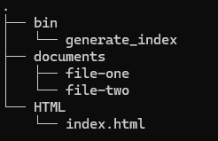

# Assignment 3 Part 2

This repository consists of files required to configure a script to run everyday at 05:00 while using a load balancer.

## Create two droplets

For this project, you will need to create 2 droplets in the same region with the same tag. The tag will be used in the load balancer

## Create a load balancer

A Load Balancer is a system that distributes traffic into two or more servers. It's purpose is to ensure no server gets overwhelmed and delivers better performance.

Create a load balancer in the same region as the two droplets. Make sure to select the tag you used earlier in the load balancer. This will put the droplets under the load balancer.

## Set up the droplets

Before we go any further, you will need to make sure your servers are up to date with the packages.

Packages required for this project: git, nginx, neovim, ufw, tree. Run the below command to install these packages.

```bash 
sudo pacman -Syu
```
This command synchronizes and updates the system
```bash
sudo pacman -S git tree nginx neovim ufw
```
Run nginx with the following command

```bash
sudo systemctl start nginx
```

## Creating a User
For this task, you will need to create a user with no login and ownership of a directory and its subdirectories.

Creating a new user:

``` bash
sudo useradd -r -d /var/lib/webgen -s /usr/sbin/nologin webgen 
```

-r creates a new user

-d sets the home directory to the location /var/lib/webgen

-s sets the settings of the user to no login

## Creating the directory:

``` bash
sudo mkdir -p /var/lib/webgen/{bin, HTML, Documents}
```
This command will create a new directory for the user webgen and also create subdirectories.

## Setting the ownership:

``` bash
sudo chown -R webgen:webgen /var/lib/webgen
```
This command sets the ownership of the directory "webgen" and all its subdirectories to the user webgen.

## Nginx

In the nginx folder, you will need to create a sites-available and sites-enabled folder. The sites-available folder will have a configuration file which will be linked to sites-enabled later.

We do this to make sure the original nginx.conf file does not get affected. This allows for better error-handling. It also allows to easily enable or disable certain sites.

Go into /etc/nginx folder and run the below commands

```bash
sudo mkdir sites-available
sudo mkdir sites-enabled
```

## Git clone

Git clone this repository into the webgen folder and use the below commands

```bash
sudo git clone <link to repo>
```

```bash
sudo mv /var/lib/webgen/generate_index /var/lib/webgen/bin
sudo mv /var/lib/webgen/generateindex.timer /etc/systemd/system
sudo mv /var/lib/webgen/generateindex.service /etc/systemd/system
sudo mv /var/lib/webgen/server.config /etc/nginx/sites-available
sudo mv /var/lib/webgen/file-one /var/lib/webgen/Documents
sudo mv /var/lib/webgen/file-two /var/lib/webgen/Documents
```

After this step, you should update the server.conf file with the IP address of your server.

At this point, you can run the "Setting the ownership" command again to ensure the ownership of the files.

If you run the "tree" command in the webgen folder, it should look like the below.



The index.html may not show yet as you have not run the timer script yet. 

## Nginx configuration

Run the below command to create a symlink
```bash
sudo ln -s /etc/nginx/sites-available/server.conf /etc/nginx/sites-enabled/server.conf
```
This symbolic link is created so that you can easily manage the configuration files through the the sites enabled without directly modifying the main nginx or sites available configuration files.

In the main nignx.conf file, under the HTML block, add "include sites-enabled/*;". 

This will ensure that any server blocks that we add in the sites-enabled folder will be added to the nginx configuration file without directly changing the config file.

## Enabling the timer:

``` bash
sudo systemctl enable --now generate-index.timer
```
This command will enable and start the timer. It should also create the index.html script under HTML. You can check this by running the "tree" command in the webgen folder.

Now, you should be able to run the load balancer's IP on the web.

## Benefits of a system user

Having a system user for this activity will allow us to prevent any accidental changes to the system. The user will have limited permissions.

## Troubleshooting
In this activity, there are times where you will need to check if the files are running or not. The below commands may help

### Checking logs and confirming service's execution:

``` bash
sudo journalctl -u generate-index.service
```
This command will generate a list of logs for .service file

### Check status of nginx services and check configuration:

``` bash
sudo nginx -t
sudo systemctl status nginx
```
These two commands will show nginx's status and test it's configuration.

It is important to set up a new config file for nginx rather than making changes to the main file as it helps prevent any accidental overwriting of the main configuration file. It also makes it easier to manage.

### Checking firewall's status:

``` bash
sudo ufw status verbose
```
This command will show what the firewalls allows for incoming and outgoing.

## References

ArchWiki. (n.d.). Nginx. Arch Linux. Retrieved December 3, 2024, from https://wiki.archlinux.org/title/Nginx

McNinch, N. (n.d.). Week thirteen notes. GitLab. Retrieved December 3, 2024, from https://gitlab.com/cit2420/2420-notes-f24/-/blob/main/2420-notes/week-thirteen.md

McNinch, N. (n.d.). Week twelve notes. GitLab. Retrieved December 3, 2024, from https://gitlab.com/cit2420/2420-notes-f24/-/blob/main/2420-notes/week-twelve.md